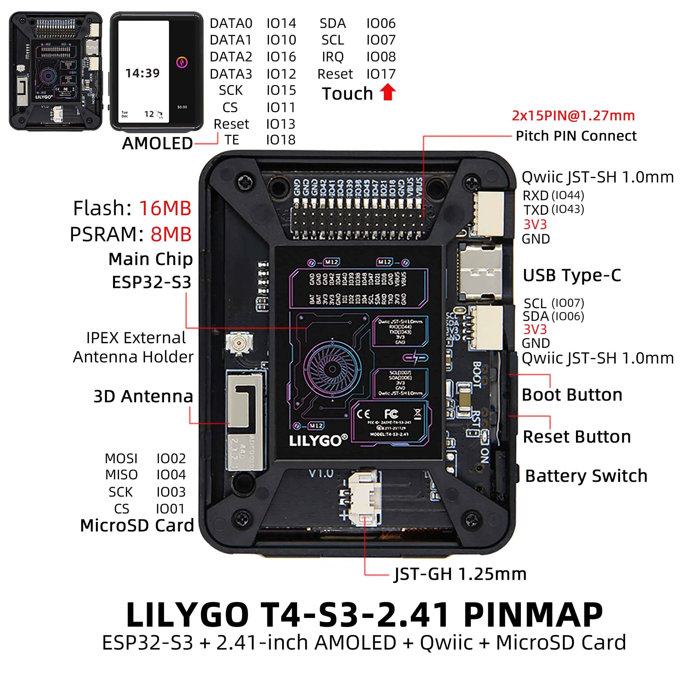

# Glider Flap Display System

A display system for gliders built using the LilyGO T4-S3 AMOLED board. This project provides pilots with essential flight information including flap position, artificial horizon, wind data, and GPS coordinates.

## Features

- Artificial Horizon Indicator (AHI)
- GPS position tracking and display
- Flap position monitoring
- Wind data visualization
- Button-based user interface
- Optional SD card data logging

## Hardware

This project uses the LilyGO T4-S3 AMOLED board, which features:
- ESP32-S3 microcontroller
- High-resolution AMOLED display
- Built-in battery management
- Multiple sensor interfaces
- SD card support

## Software Architecture

Built with PlatformIO and ESP-IDF framework, the system:
1. Manages board initialization and power
2. Collects data from multiple sensors (GPS, IMU, flap sensor)
3. Processes and displays flight information
4. Handles user input through buttons
5. Optionally logs flight data

## Dependencies

- **XPowersLib**: Power management
- **SensorLib**: Sensor interfaces
- **AceButton**: Button handling
- **TinyGPSPlus**: GPS data parsing
- **TFT_eSPI**: Display graphics

## Documentation

### Hardware Resources
- [T4-S3 Product Page](https://www.lilygo.cc/products/t4-s3)
- [Schematic](./schematic/T-Display-S3%20AMOLED-Touch.pdf)
- [PCB Design Files](./dimensions/T4-S3-AMOLED.DWG)
- [3D Model](./dimensions/T4-S3-AMOLED-PCB-3D.7z)

### Component Datasheets
- [ESP32S3-R8 Microcontroller](https://www.espressif.com.cn/en/support/documents/technical-documents?keys=&field_type_tid%5B%5D=842)
- [SY6970 Battery Charger](./datasheet/SY6970%20Datasheet.pdf)
- [RM690B0 AMOLED Driver](./datasheet/RM690B0%20DataSheet_V0.2.pdf)
- [CST226 Touchscreen](https://github.com/lewisxhe/SensorLib)
